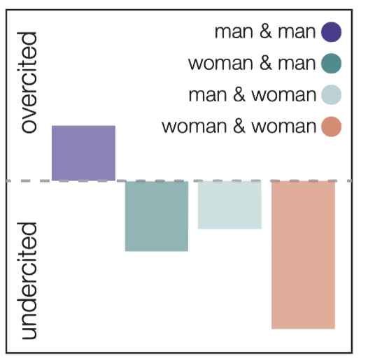
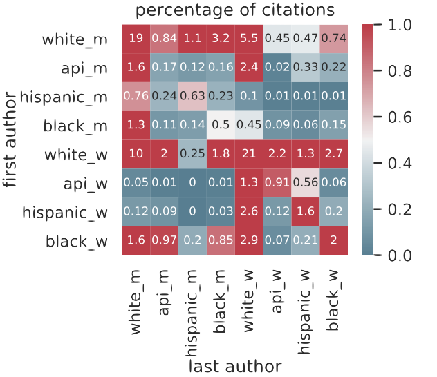

---
author:
categories:
date: "2022-04-21"
draft: false
excerpt: As the academic community becomes more complex and interconnected, the generation of innovative ideas will increasingly rely on researchers forming new connections to historically marginalized voices and historically distant fields. To gain a better understanding of the scientific process, my colleagues and I have investigated the relationships between scientists and scientific papers. Using novel network scientific approaches, this work has revealed the importance of interdisciplinary links and uncovered pervasive gender- and race-based inequity in citation practices. Ongoing projects seek to expand this line of research into new scientific disciplines and dimensions of bias, and to explore potential mechanisms for mitigating such inequities.
layout: single
links:
subtitle:
tags:
- Meta-science
title: Structures of innovation and inequity in scientific research
---

### Citational inequity in scientific research

In recent years, science has been pushed to grapple with the vast gender and racial/ethnic imbalances in academic participation. In addition to large and persistent gaps in the proportion of minoritized groups across scientific fields1, research has identified imbalances along various measures of academic inclusion and success. Such inequalities have been found in [compensation](https://www.pnas.org/doi/10.1073/pnas.1211286109), [grant funding](http://www.pnas.org/lookup/doi/10.1073/pnas.1510159112), credit for [collaborative work](https://www.aeaweb.org/articles?id=10.1257/aer.p20171126), [teaching evaluations](https://www.sciencedirect.com/science/article/abs/pii/S0047272716301591), [hiring and promotions](https://academic.oup.com/spp/article-lookup/doi/10.1093/scipol/scv052), and [authorship](http://www.pnas.org/lookup/doi/10.1073/pnas.1914221117). Despite efforts to increase participation in leadership and representation in seminars/conferences, the presence of differential engagement with minoritized scholars' work could lead to prolonged inequities in other areas. Recent studies of such engagement have indeed found that people from marginalized groups are often undercited.

Because of the potential downstream effects of inequitable engagement with work led by gender and racial/ethnic minority scholars, the study of citation behavior is a critical endeavor for understanding and addressing biases in a particular field. Additionally, achieving gender equity within reference lists can be pursued by all researchers (unlike, for example, achieving gender equity within keynote-speaker roles). Thus, in our work, collaborators [Dani Bassett](https://complexsystemsupenn.com/), [Perry Zurn](https://www.perryzurn.com/), and I seek to determine the existence and potential drivers of gender imbalance in neuroscience citations. Building on previous work that highlighted gaps in papers' citation counts, we investigate the relationship between authors’ gender/race and the gender/racial makeup of their reference lists. Using this framework, we are able to quantify properties associated with authors serving as both objects and agents of undercitation. Our studies have found extensive and pervasive undercitation of [women](https://www.nature.com/articles/s41593-020-0658-y) and [people of color](https://www.biorxiv.org/content/10.1101/2020.10.12.336230v1), and have shown that such biases are primarily driven by the citation behavior of those in the gender/racial majority. We have also found that such biases occur across a [variety](https://arxiv.org/abs/2112.09047) of [disciplines](https://www.tandfonline.com/doi/full/10.1080/23808985.2021.1960180).

### Building and disseminating citation resources

Within the scope of this work on equity in scientific research, our group has led efforts to provide publicly available software for [conducting citation analysis](https://github.com/jdwor/gendercitation). The production of this software has inspired several affiliated and unaffiliated research teams to extend the published findings into new scientific disciplines. We have also developed software that allows users to assess the make-up of [their own bibliographies](https://github.com/dalejn/cleanBib). This tool has been used by dozens of affiliated and unaffiliated research teams to create more equitable reference lists and incorporate citation diversity statements into their work. Through our research and outreach, we have also helped to introduce and advocate for the concept of a "Citation Diversity Statement" in scientific manuscripts. The incorporation of this statement into manuscripts encourages transparency and introspection during literature review and paper writing, and will hopefully aid in mitigating imbalances.

### Related papers
- [The extent and drivers of gender imbalance in neuroscience reference lists](https://www.nature.com/articles/s41593-020-0658-y). *Nature Neuroscience*, 2020
- [(In)citing action to realize an equitable future](https://www.cell.com/neuron/fulltext/S0896-6273(20)30357-3). *Neuron*, 2020
- [Racial and ethnic imbalance in neuroscience reference lists and intersections with gender](https://www.biorxiv.org/content/10.1101/2020.10.12.336230v1.abstract). *bioRxiv*, 2021
- [Gendered citation practices in the field of communication](https://www.tandfonline.com/doi/full/10.1080/23808985.2021.1960180). *Annals of the International Communication Association*, 2021
- [Citation inequity and gendered citation practices in contemporary physics](https://arxiv.org/abs/2112.09047). *Annals of the International Communication Association*, 2021

### Related code
- [CleanBib reference list assessment tool](https://github.com/dalejn/cleanBib). *Python binder*, 2021
- [Code for "The extent and drivers of gender imbalance in neuroscience reference lists"](https://github.com/jdwor/gendercitation). *GitHub repo*, 2021
- [Google scholar citation transparency tool](https://chrome.google.com/webstore/detail/citation-transparency/cepnbdbhabaljgecaddglhhcgajphbcf?hl=en). *Chrome extension*, 2021

