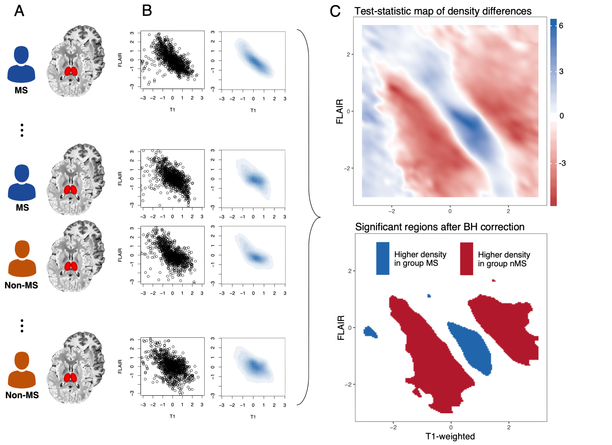

---
author:
categories:
date: "2022-04-22"
draft: false
excerpt: The use of magnetic resonance imaging (MRI) for detecting disease-related pathologies can be hampered by the infeasibility of manual inspection. For visible structural pathologies, rigid criteria can lead to high time burdens on already over-burdened clinicians. For diffuse, unobservable, or multi-modal pathologies, it may be difficult or impossible for a clinician to obtain accurate visual assessments. To enable faster and more powerful detection of pathologies in brain tissue, my colleagues and I work on developing data-driven statistical methods that can make probabilistic and inferential conclusions about the occurrence of tissue abnormalities, and can reveal links to disease status or patient characteristics.
links:
subtitle:
tags:
- Neuroimaging methods
- Applied neuroimaging
title: Statistical methods for diagnosis and screening using neuroimaging data

---

### White matter lesions in multiple sclerosis

Multiple sclerosis (MS) is a chronic disease of the central nervous system, characterized by progressive cognitive and motor disability. The high financial burden of MS treatments, and their heterogeneity in efficacy across patients, makes the detection of clinical biomarkers a vital goal in MS research. The presence of robust biomarkers could facilitate better individualization of care, allow for more efficient clinical trials, and even provide predictive insight into patients’ likely disease courses. Because MS is characterized by demyelinating lesions in the central nervous system, brain imaging has taken a central role in MS care and research. The presence of new lesions on a MRI scan is considered an important clinical marker of disease activity, yet MRI-based measures of disease severity have been elusive. This lack of strong links between patients' clinical outcomes and their imaging measures has been dubbed the ["clinico-radiological paradox"](https://pubmed.ncbi.nlm.nih.gov/12045719/) in MS.

Over the years my colleagues and I have sought to develop and apply new statistical methods for resolve this paradox. With collaborators at Penn and the NIH, I approached the question of how to obtain obscured historical information by developing [a method for delineating](http://www.ajnr.org/content/39/4/626) overlapping lesion tissue into distinct anatomical insults using a single cross-sectional scan. This approach has facilitated the assessment of individual lesions unique pathophysiological properties and clinical implications. With collaborators at the University of Vermont, I developed [an automated method](http://www.ajnr.org/content/39/10/1806) for detecting a lesion biomarker that distinguishes MS-based lesions and "mimics" that arise due to other neurological sources. This approach has been implemented in ongoing multi-center studies, and shows promise for aiding in radiological analysis and diagnosis. And with colleagues from Brigham & Women's Hospital, I have worked on [an approach for uncovering diffuse](https://academic.oup.com/biostatistics/article-abstract/22/3/646/5687017) disease-specific patterns in healthy-appearing tissue. 

### Applied imaging in neurology and psychiatry

My collaborative neuroimaging work focuses on applying structural MRI methods in neurological and psychiatric contexts. This includes projects directly related to my methodological research, such as contributing to an automated method for detecting [MS lesion subtypes](https://www.sciencedirect.com/science/article/pii/S2213158221002400), developing a model to predict [long-term lesion recovery](https://www.sciencedirect.com/science/article/pii/S2213158216301358), assessing the role of [white matter hyperintensities](https://jamanetwork.com/journals/jamanetworkopen/article-abstract/2784767) on cortical atrophy in Alzheimer's disease, and developing methods to extract imaging biomarkers of [cerebral malaria](https://www.biorxiv.org/content/10.1101/2020.12.23.424020v3.abstract) in the absence of high resolution MRI scanners.

### Related papers
- [A local group differences test for subject-level multivariate density neuroimaging outcomes](https://academic.oup.com/biostatistics/article-abstract/22/3/646/5687017). *Biostatistics*, 2021
- [Association of regional white matter hyperintensities with longitudinal Alzheimer-like pattern of neurodegeneration in older adults](https://jamanetwork.com/journals/jamanetworkopen/article-abstract/2784767). *JAMA Network Open*, 2021
- [Automated integration of multimodal MRI for the detection of the central vein sign in white matter lesions](http://www.ajnr.org/content/39/10/1806). *American Journal of Neuroradiology (AJNR)*, 2018
- [An automated statistical technique for counting distinct multiple sclerosis lesions](http://www.ajnr.org/content/39/4/626). *AJNR*, 2018
- [Predicting recovery through estimation and visualization of active and incident lesions](https://www.sciencedirect.com/science/article/pii/S2213158216301358). *NeuroImage: Clinical*, 2016
- [Automated analysis of low-field brain MRI in cerebral malaria](https://www.biorxiv.org/content/10.1101/2020.12.23.424020v3.abstract). *Biometrics*, In press

### Related code
- [Lesion quantification toolkit](https://github.com/jdwor/LQT). *R package*, 2021
- [Multi-modal density test](https://github.com/jdwor/mmdt). *R package*, 2020
- [PennSIVE lesion tools](https://github.com/PennSIVE/lesiontools). *R package*, 2021.
